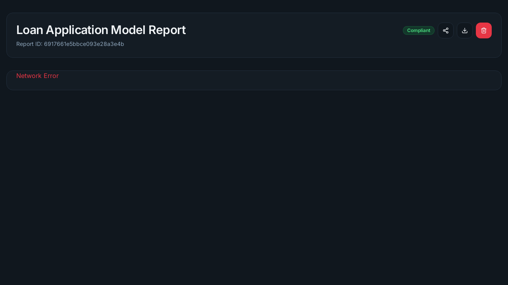

# Day 6 — Demo-ready release notes

This document summarizes the Day‑6 demo work: end-to-end integration between frontend, backend, and ai_core; fixes for CI and pre-commit; and demo artifacts.

Demo report

- Demo run created report id: `6917661e5bbce093e28a3e4b`
- Frontend report URL (local demo): http://localhost:3000/report/6917661e5bbce093e28a3e4b

Screenshot

The frontend report page screenshot captured during the demo is included below.



Key fixes included in this delivery

- Bumped `detect-secrets` pre-commit hook and regenerated `.secrets.baseline` to fix pre-commit failures.
- Added system build dependencies and resilient imports in `ai_core` Dockerfile and modules so the service builds successfully in Docker.
- Implemented PNG fallback plotting (matplotlib) in `ai_core` and return `explanation_plot` as a base64 PNG when SHAP plotting isn't available.
- Fixed `frontend` Dockerfile for a correct multi-stage build so `next start` does not attempt to download SWC at runtime.
- Hardened `tools/e2e_demo.sh` and demo orchestration for reliable local demo runs.

Next steps / recommendations

- Decide whether to revert the temporary Mongo host-port mapping (currently bound to host port 27018) or document the workaround for local developers with a host Mongo.
- Optional: push the `day6/demo-ready` branch and open a PR with these changes and a short description of verification steps.

Generated: 2025-11-14
# Day 6 — Release Notes & Verification

This document summarizes the Day 6 deliverables, verification steps, and files changed. Use this as the final checklist before marking Day 6 complete.

Summary
-------
- Fixed CI / pre-commit blockers (detect-secrets baseline + hook alignment).
- Implemented end-to-end demo script: `tools/e2e_demo.sh`.
- Polished frontend UX: upload form loaders/status and report page improvements.
- ai_core now optionally generates a small PNG explanation plot (base64 data URI) and stores it in the analysis document.
- Frontend renders the explanation image if available.
- Added frontend unit tests (Vitest + Testing Library) for the `report/[id]` page and test setup.

Files changed (high-level)
- `ai_core/routers/analyze.py` — add explanation plot generation and include `explanation_plot` in stored doc.
- `ai_core/requirements.txt` — add `matplotlib` and `pillow`.
- `frontend/src/app/report/[id]/page.tsx` — client-side fetch, loading/error state, SHAP image rendering.
- `frontend/src/components/dashboard/upload-form.tsx` — loader/status improvements for upload & analyze actions.
- `frontend/src/__tests__/report-page.test.tsx` — unit test for report page.
- `frontend/vite.config.ts`, `frontend/src/setupTests.ts`, `frontend/package.json` — test infra.
- `tools/e2e_demo.sh` — demo automation script.
- `docs/day6-demo.md` — demo instructions.

Verification checklist (local)
1. Frontend build and tests

```bash
cd frontend
npm ci
npm run build
npm test
```

2. ai_core tests

```bash
python -m venv .venv_ai_core
source .venv_ai_core/bin/activate
pip install -r ai_core/requirements.txt
pytest ai_core/tests
```

3. Backend tests

```bash
cd backend
npm ci
npm test
```

4. End-to-end demo (Docker required)

```bash
chmod +x tools/e2e_demo.sh
./tools/e2e_demo.sh
# when finished
docker compose -f docker-compose.yml down
```

If the demo fails, capture the script output (full logs) and the container logs:

```bash
docker compose -f docker-compose.yml logs --no-color --tail=200 > demo-logs.txt
```

Security checklist
- Run `detect-secrets` locally and inspect `.secrets.baseline` for any entries that look like real credentials.
- Rotate any real tokens found in history before a public demo.

Notes & recommendations
- The ai_core `explanation_plot` is stored as a base64-encoded PNG for demo convenience. For production or larger images, prefer object storage (S3 or mounted volume) and return a URL instead of embedding base64 data in the DB.
- Consider adding a smoke e2e CI job that runs a lightweight `ai_core` synthetic analysis (no heavy datasets) to verify end-to-end integration in CI.

Sign-off
---------
When you have run the end-to-end demo successfully and captured screenshots/GIFs, mark Day 6 as complete. If you'd like, I can prepare a PR with the final release notes and a short demo GIF embedded in `docs/day6-release.md`.
